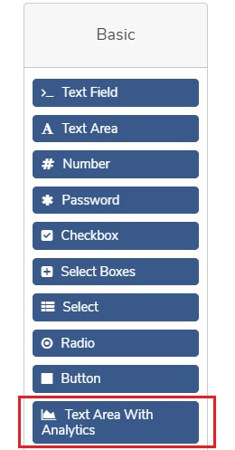
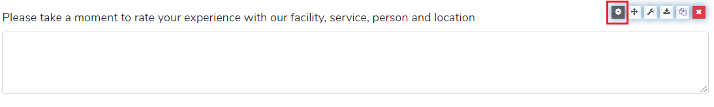
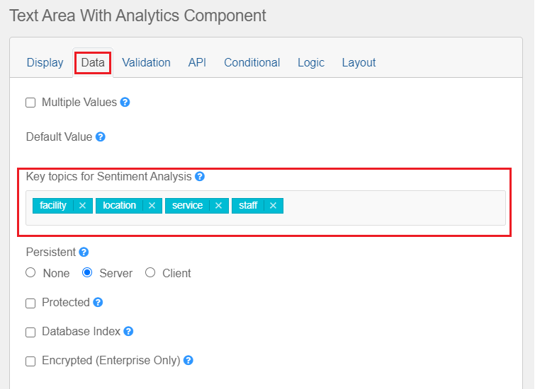

## Text area with analytics component

This custom component is used for processing the data in the Text area
fields to be used for **Sentiment Analysis**. 

To use the custom component in **formsflow.ai** follow the below steps:

- Login with the designer role
- Choose a new/existing form and click the edit forms button
- Drag and drop **Text Area with Analytics** component from the Basic section in left panel

- Choose the **settings icon** of Text Area with Analytics component and go to 
section Data

- Select the **Key topics for Sentiment Analysis** like facility, service, location, etc.

- Click the save button.
